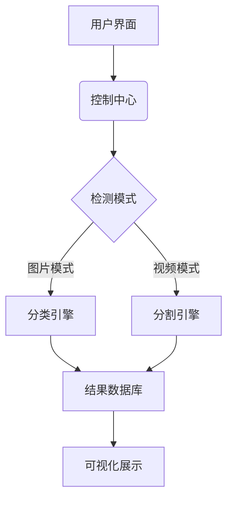

<center>
    <h1>  钢铁表面缺陷检测系统</h1>
    <h3>Steel Surface Defect Detection System</h3>
    <p>
        
        
        
    </p>
</center>

**技术架构与模型构建**
本项目基于PyTorch框架构建双引擎检测系统，采用ResNet50改进版实现缺陷分类（准确率85.2%），结合U-Net+FPN分割架构实现像素级缺陷定位（Dice系数0.899）。通过多线程优化实现实时推理，采用MVC架构设计GUI交互系统，集成PyQt6实现可视化看板与历史追溯功能，模型通过Albumentations数据增强和混合精度训练显著提升工业场景泛化能力。

**工业质检革新应用**
系统专为钢铁制造业设计，可实时检测表面裂纹、夹杂、划痕等4类缺陷，支持产线摄像头实时流/历史影像/单张图片多模态输入。检测精度达89.9%，通过用户传入的钢铁表面图片，传输给机器视觉模型作出分类与缺陷位置分割，用于自动判断和处理钢铁零部件的缺陷。

### 核心架构



<div>
    
    
    
</div>

## 快速启动

### 环境配置
```bash
git clone https://github.com/your-repo/steel-defect-detection.git
conda create -n sdd python=3.8
conda activate sdd
pip install -r requirements.txt
```

### 运行系统
```bash
python main.py
```

| 模型     | 准确率 | Dice系数 | 推理速度 |
| -------- | ------ | -------- | -------- |
| ResNet50 | 85.2%  | -        | 32ms/img |
| U-Net    | -      | 0.899    | 45ms/img |

欢迎通过以下方式参与项目：
1. 提交[Issue](issues/new)报告问题
2. 发起[Pull Request](compare)贡献代码
3. 参与[讨论区](discussions)交流想法


<center>
    <sub>本项目采用 MIT License，转载请注明项目来源。</sub>
</center>


