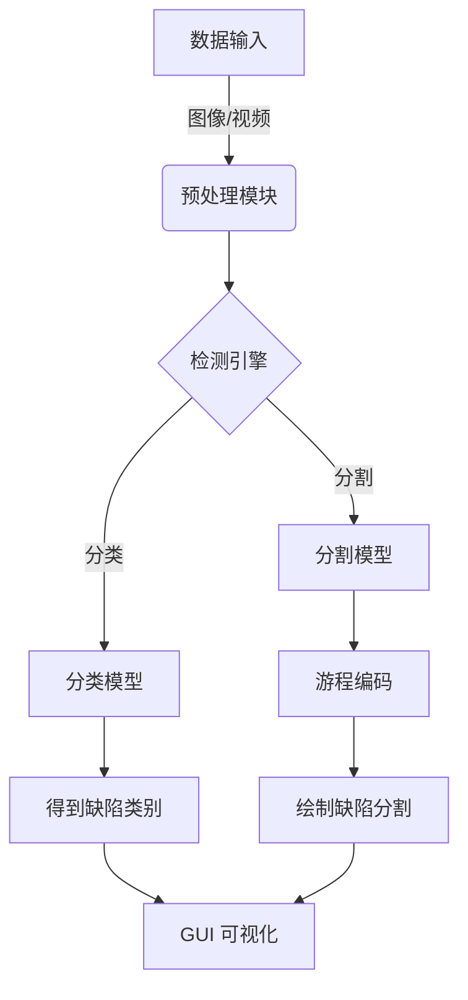
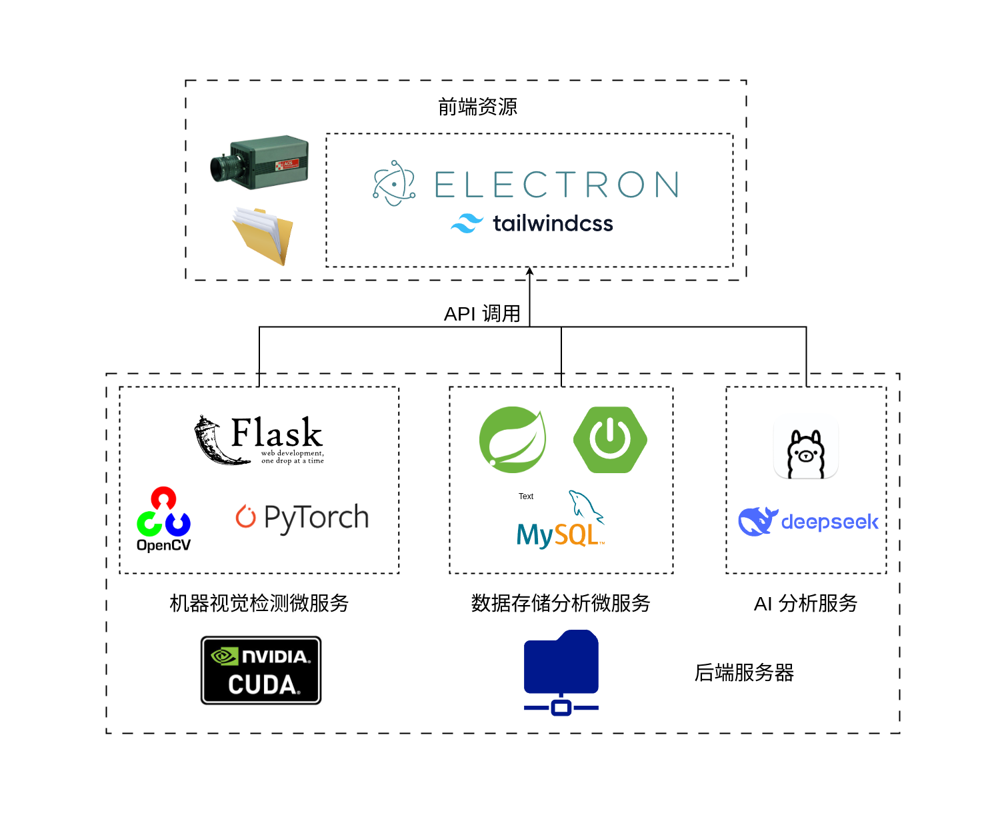

<center>
  <h1> 钢铁表面缺陷检测系统</h1>
  <h3>Steel Surface Defect Detection System</h3>
  <p style="white-space: nowrap;">
    
    
    
    
    
  </p>
</center>

## 引言与项目背景

本项目是一套面向工业现场的金属部件表面缺陷检测系统，主要用于车辆零部件等制造过程中的质量控制。系统可识别裂纹、划痕、夹杂等多种典型缺陷，适用于复杂材质和结构的零件表面。

检测流程采用“分类+分割”的方式，先通过分类模型快速筛除无缺陷图像，再使用分割模型进行精准定位，兼顾检测速度与准确率。系统内置图形化界面，操作简单，支持缺陷查看、统计和结果导出。

## 系统设计与方法

### 数据与模型

数据集采用 Severstal 钢材缺陷检测竞赛的数据集和评价指标，利用机器学习算法，通过图像分析，自动检测并定位钢板表面的缺陷。

本项目基于PyTorch框架构建双引擎检测系统，采用基于 `ResNeXt50_32x4d` 的卷积神经网络对输入图片进行分类（准确率85.2%），分割模型采用 U-Net 与 FPN 的组合架构，实现像素级缺陷定位（Dice系数0.899）。通过多线程优化实现实时推理，采用MVC架构设计GUI交互系统，集成PyQt6实现可视化看板与历史追溯功能，模型通过Albumentations数据增强和混合精度训练显著提升工业场景泛化能力。

系统专为钢铁制造业设计，可实时检测表面裂纹、夹杂、划痕等4类缺陷，支持产线摄像头实时流/历史影像/单张图片多模态输入。检测精度达89.9%，通过用户传入的钢铁表面图片，传输给机器视觉模型作出分类与缺陷位置分割，用于自动判断和处理钢铁零部件的缺陷。

以下是图片数据输入后经过模型检测并处理得出最终结果的流程图。最终计时，每一张图片在分类和分割所花费的时间相加，整体系统的推理速度在 80~100 ms/img。



| 模型     | 准确率 | Dice系数 | 推理速度 |
| -------- | ------ | -------- | -------- |
| 分类模型 | 85.2%  | -        | 32ms/img |
| 分割模型 | -      | 0.899    | 45ms/img |

## 环境配置

```bash
git clone https://github.com/your-repo/steel-defect-detection.git
conda create -n sdd
conda activate sdd
pip install -r requirements.txt
```




### 运行系统

```bash
# 机器视觉检测服务
python3 app.py

# 数据库服务
java -jar database_server/target/SDDAnalyzer-0.0.1-SNAPSHOT.jar

# 前端交互界面
npm run start
```

<center>
    <sub>本项目采用 MIT License，转载请注明项目来源。</sub>
</center>
