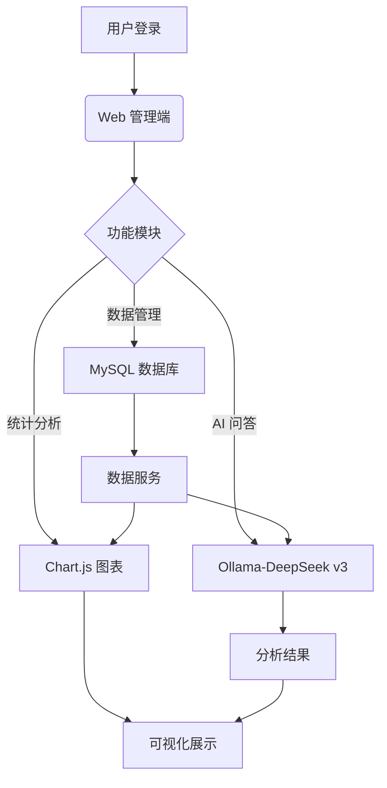

    <h1>  钢铁表面缺陷分析平台</h1>
    <h3>Steel Surface Defect Detection Analyzer</h3>
    

        
        
        
        
    

## 摘要

随着制造业对质量控制需求的提升，钢铁表面缺陷的智能化分析成为关键技术挑战。本研究开发了一款基于 Web 的钢铁表面缺陷分析平台（Steel Surface Defect Detection Analyzer, SDD Analyzer），采用 Spring Boot 3.4.3 框架构建，结合 MySQL 数据库和本地部署的 Ollama-DeepSeek v3 模型，实现缺陷数据的存储、统计分析与智能问答功能。平台通过用户验证确保访问安全，支持数据可视化图表绘制，并允许用户基于数据提出问题，由本地 AI 模型分析并回答。系统具有本地化部署、数据隐私保护、高扩展性和实时交互等特点，显著提升了工业质检效率与决策支持能力，为钢铁制造业提供了创新解决方案。 

## 1. 引言

钢铁表面的缺陷（如夹杂物、划痕等）直接影响产品质量和生产安全。传统检测依赖人工或独立设备，数据分散且分析效率低下，难以满足现代工业对实时性和智能化的需求。近年来，Web 技术和人工智能的结合为缺陷数据管理与分析提供了新路径。然而，现有系统多依赖云端 AI 服务，存在数据泄漏风险和高延迟问题。 本研究提出了一种本地化、智能化的钢铁表面缺陷分析平台，基于 Java 和 Spring Boot 框架开发，集成 MySQL 数据库和 Ollama 部署的 DeepSeek v3 模型。平台通过 Web 管理端提供用户验证、数据管理与可视化功能，支持用户基于缺陷数据提问并获取 AI 分析结果。其核心创新包括本地 AI 部署保障数据安全、高效的数据处理与实时交互能力。

## 2. 系统设计与实现 

### 2.1 系统架构
系统采用前后端分离架构，前端基于 JavaScript 语言进行 API 调用以将数据库数据提取到前端，前端基于 Tailwind 渲染，后端通过 Java Spring Boot 提供 RESTful API 服务。整体流程如下： 

### 2.2 用户验证

用户在登录界面首先会收到模态框填写表格，用户需要填写用户名密码与验证码，才能提交。前端发送数据至 `/api/users/username/{username}` 获取用户信息，后端从数据库中查询并返回记录，比对密码实现用户登陆验证。

### 2.3 数据管理与存储

**技术选型**：采用 MySQL 8.0 作为数据库，通过 MyBatis 3.0.4 实现数据访问。

实现逻辑：ResultService 类提供数据查询服务（getAllResults 和 getResultById），从数据库提取缺陷记录（包括 ID、名称、日期、标签等）。数据通过 REST API（如 /api/data/getAll）传输至前端。

获取到所有记录后，前端依据 Chart.js 框架生成图表以实现图形化数据。

### 2.5 AI 分析与问答

本地部署：使用 Ollama 部署 DeepSeek v3 模型于本地服务器，避免数据传输至外部云端。保障数据隐私，降低网络延迟。

实现逻辑：DeepSeekController 通过 REST API（/api/ai/analyze）接收用户提问（prompt）。

ps：在实现时为了保证运行速度和稳定性，暂时先采用了官方 Deepseek API，可改为本地 Ollama 接口（假设地址为 http://localhost:11434/api/chat）。