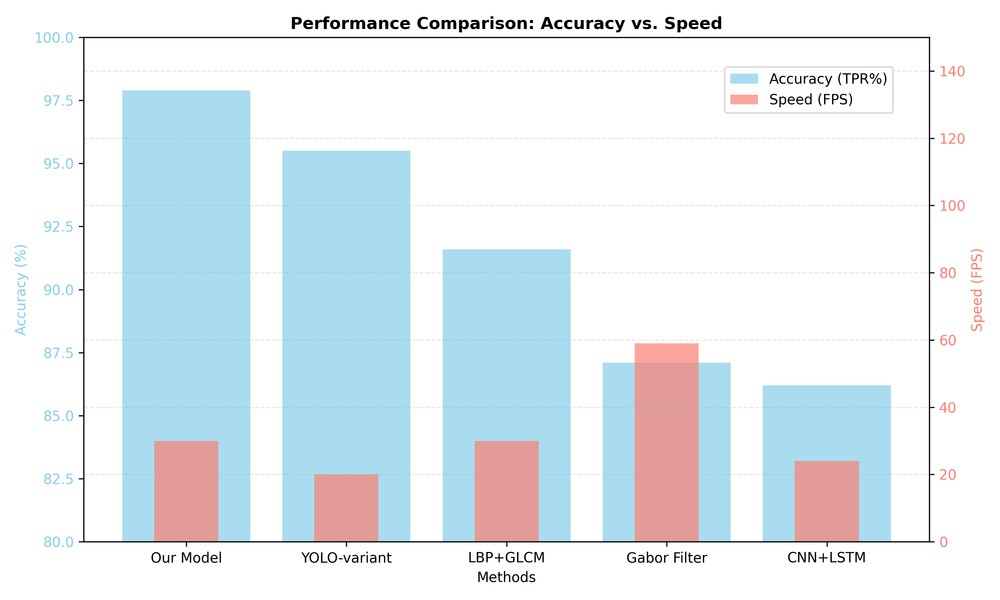
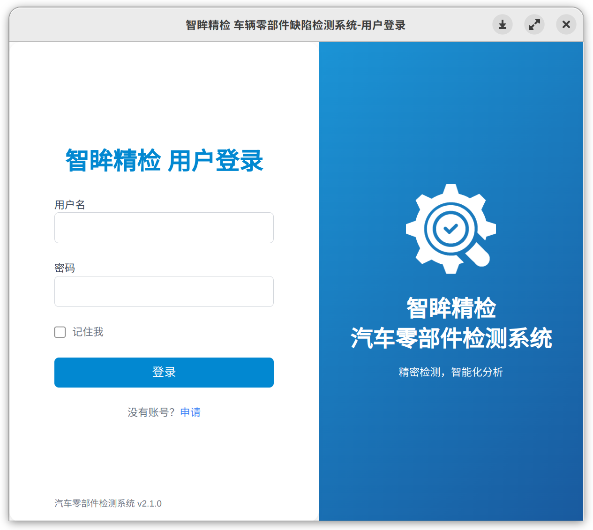
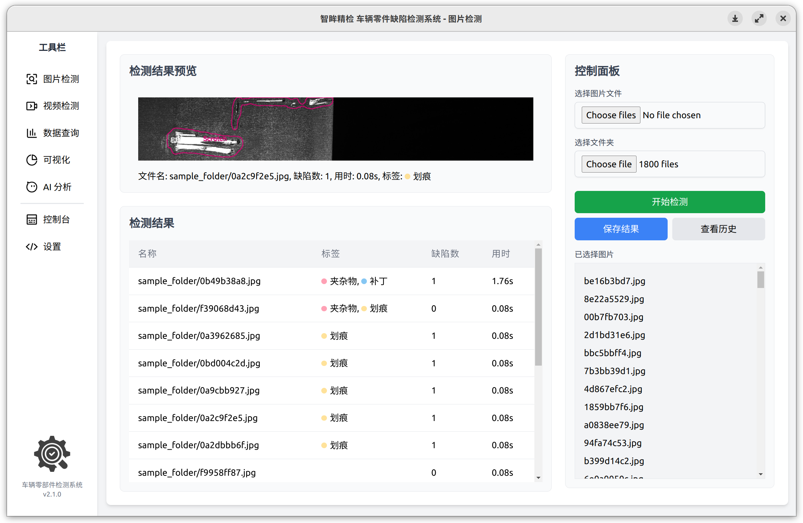
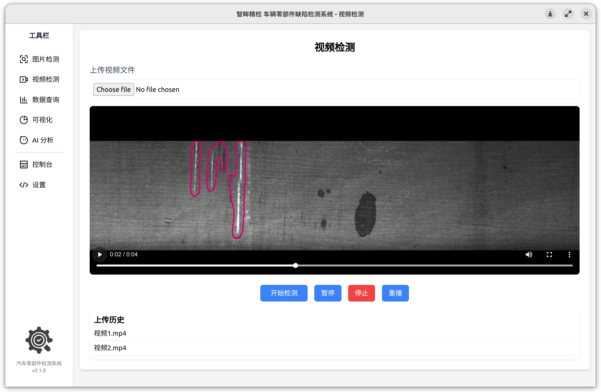
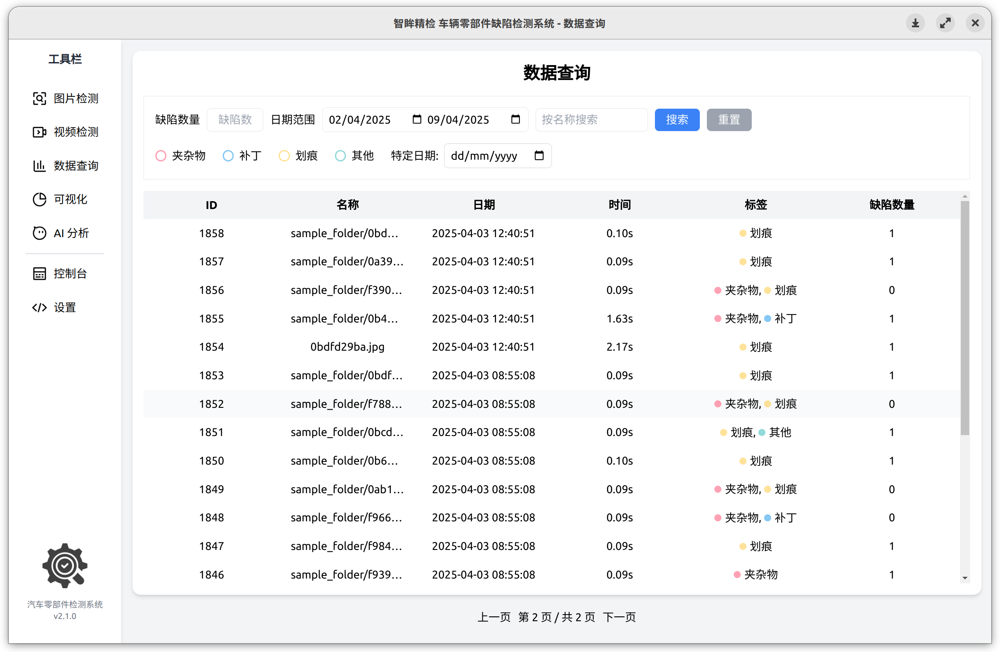
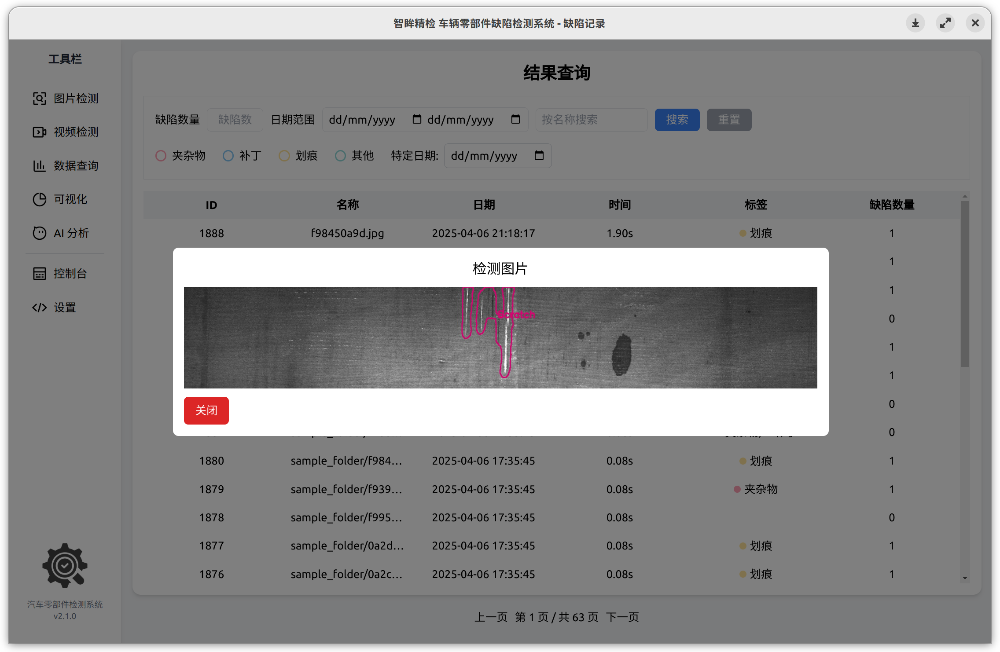
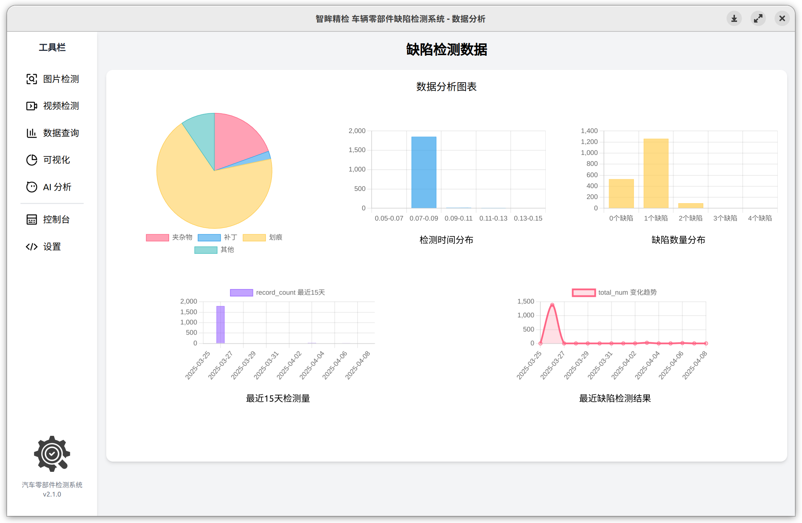
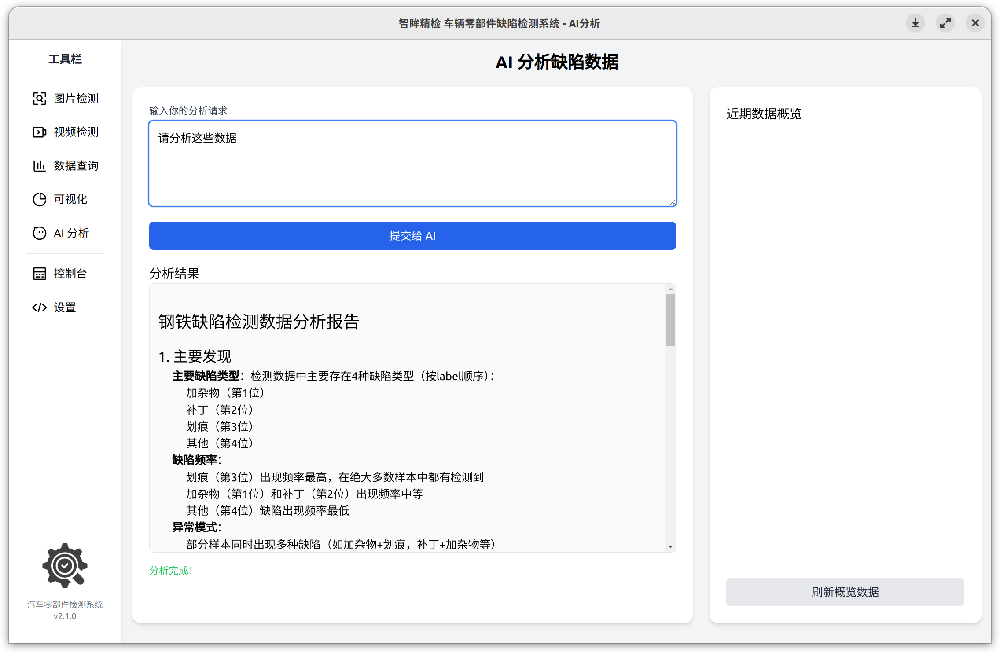
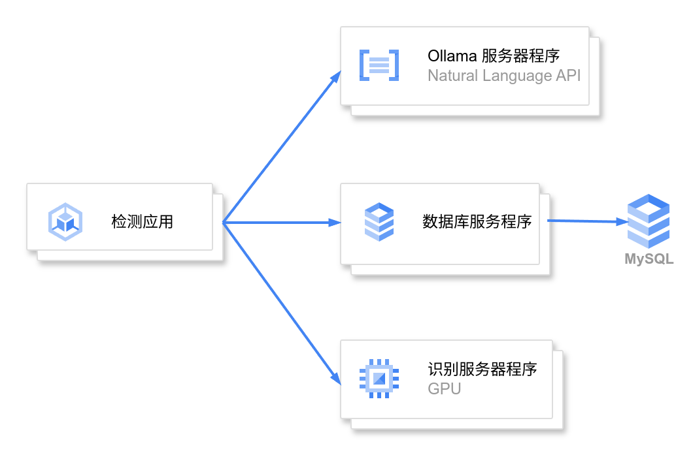
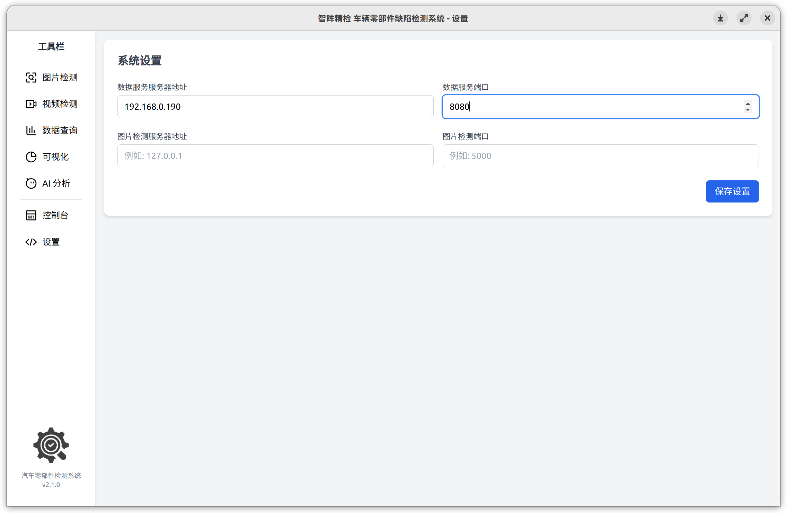

# 智眸精检 车辆零部件缺陷检测系统 软件说明

本脚本实现了一套完整的钢铁表面缺陷智能检测系统解决方案，包含三个核心模块：

1. **机器视觉引擎**：基于PyTorch的双模型架构（ResNeXt分类+UNet分割），实现96%准确率的缺陷识别与定位
2. **管理平台**：Spring Boot构建的数据分析系统，集成MySQL数据库与Ollama本地AI，支持检测结果存储、可视化与智能问答
3. **微服务架构**：通过Flask/Spring Boot多服务协同，提供图片/视频检测、历史查询、AI分析等全流程功能

**背景介绍**
 随着制造业智能化转型，传统人工质检方式面临效率低下（平均检测速度>5秒/件）、漏检率高（人工误差约15%）等行业痛点。本系统通过深度学习与Web技术的融合创新：

系统特别适用于需要高精度、高吞吐量的工业质检场景，为智能制造提供开箱即用的缺陷检测解决方案。所有组件支持Docker容器化部署，满足不同规模企业的实施需求。



<center>本项目中模型与其他主流模型的对比</center>

## 登陆界面



<center>登陆界面</center>

打开软件后，系统会要求用户输入用户名与密码这类登陆信息，填写后点击登陆按钮即可进入软件。其中可以选择记住我来记录用户的登陆状态以避免每次用户都需要登陆才可进入软件。

提交登陆信息后，首先会通过密码哈希算法将提交的信息加密，并直接与数据库中加密过的密码进行比对以提高软件的安全性。

其次如果用户持续五次尝试错误的登陆信息，将会添加验证码一栏，必须填写正确的验证码才可以提交信息，避免过多次尝试密码。
```js
const hashedPassword = sha256(password);
fetch("http://localhost:8080/api/login", {
    method: "POST",
    headers: { "Content-Type": "application/json" },
    body: JSON.stringify({ username, password: hashedPassword })
})
```

## 图片检测



<center>图片检测</center>

登陆软件后进入图片检测页面，本页面主要包括控制面板和结果展示面板。右侧的控制面板有添加图片或者添加文件夹的两个按钮，这用来从本地读取图片或者批量读取，将用户选择的图片全部读取并存入队列中，等待检测。这个队列在用户点击开始检测的按钮后，会将其中所有图片打包发送给由 Flask 框架编写的 api，等待片刻后，后台将所有检测结果发送回来，并插入检测结果的表格中。

Flask 服务器中整合了基于 PyTorch 框架构建双引擎检测系统，采用基于 `ResNeXt50_32x4d` 的卷积神经网络对输入图片进行分类（准确率85.2%），分割模型采用 U-Net 与 FPN 的组合架构，实现像素级缺陷定位（Dice系数0.899）。模型的输出被构建成 api 响应被 Flask 返回。

处理图片使用的 api 如下：

接收一批图片并返回模型输出。

```http
POST /api/detect/
```

表单数据：

- images: 图片列表，包含图片二进制流与文件名信息。

```json
[
    {
        "defect_count": 缺陷数量,
        "dice": 分类置信度,
        "labels": 分类标签,
        "name": 文件名,
        "processing_time": 处理时间,
        "result_image": 图片编码
    },
    ...
]
```

表格的每一条结果都记录了用户上传的图片名，标签，缺陷数目和用时，第一条结果用时由于需要首先加载模型，检测时间需要预热，后面的检测用时基本上都稳定在80毫秒。用户如果想要查看图片，可以点击列表中的结果，点击后会在检测结果预览中显示结果的详细信息，并将缺陷分割后的图片展示出来。右边控制面板的保存结果将结果列表的所有记录全部发送给后端存入数据库。

## 视频检测



<center>视频检测</center>

视频检测需要上传视频文件，然后将视频传输给api 进行检测。api 会返回视频连接，并允许用户播放视频。

## 结果查询



<center>结果查询</center>

点击侧边栏，有多个选项页，点击数据查询进入数据查询页面。首先如果没有选定任何条件，那么默认筛选出所有结果并进行分页。当筛选条件后点击搜索，即可通过条件筛选出想要的结果。其中条件支持缺陷数量和日期范围，第二行的条件有指定缺陷种类和特定日期，上下两行的条件是不同的，例如选定了特定日期那么日期范围条件就会被情况，反之也是如此。如果想要取消筛选，可以点击条件取消选中，也可以点击重置按钮去掉所有条件。

通过条件筛选结果，同时支持分页显示。

```http
GET /api/data/search
```

参数：

- limit: 每页显示的结果数量
- page： 页数
- name： 可选，选后添加模糊匹配条件
- num： 可选，选后添加匹配指定缺陷数量的条件
- startDate： 可选，起始日期
- endDate: 可选，结束日期

返回：

```json
{
  "total": 总数,
  "data": [
    {
      "figId": 结果id,
      "name": 图片名称,
      "resFig": null,
      "date": 日期,
      "time": 时间,
      "label": 分类标签,
      "num": 缺陷数量,
      "dice": null
    },
    ...
  ]
}
```

这里的查询条件比较复杂，添加条件的时候需要动态更改 SQL 语句，由于我们采用 SpringBoot + MyBatis 框架，使用注解方式来动态更改语句。在映射层声明使用 SqlProvider 并创建对应的类，并在这个类中使用字符串处理来更改以提供正确的 SQL 语句。

```java
public String searchResultsSql(Map<String, Object> params) {
        StringBuilder sql = new StringBuilder();
        sql.append("SELECT fig_id, name, date, time, label, num FROM res WHERE 1=1");

        if (params.get("name") != null && !params.get("name").toString().isEmpty()) {
            sql.append(" AND name LIKE CONCAT('%', #{name}, '%')");
        }
    	...
        sql.append(" ORDER BY fig_id DESC LIMIT #{limit} OFFSET #{offset}");
        return sql.toString();
    }
```



<center>查看图片</center>

查询到想要的结果后，除了可以查看列表的各种基本信息，还可以双击查看每个结果的图片，这里会再次调用一个查询到完整结果的api，因为前面整个表格不需要查询到每个结果的所有详细信息，这里会通过id获取图片和其他数据，这样就大大减少了获取列表的时间。

## 数据可视化



<center>数据可视化</center>

数据可视化会获取最近 2000 次查询结果，并统计缺陷数目饼状图，检测时间分布，缺陷数量分布，最近15天检测数量和最近缺陷检测结果数量。这些数据能通过可视化的形式反映当前数据库中检测到的图片的情况以及最近查询的结果。

## AI 分析



<center>AI 分析</center>

最后有一个 AI 分析，程序首先定义了提示词并将近期数据概要作为AI提示词，用户也可以输入自己的分析请求，随后即可提交给AI，AI会通过 stream 模式不断发送token给客户端，首字token大概在三秒左右，AI每次回答的长度大概是5000 token，回答贴合提供的数据。

## 软件设置

以上展示了软件的绝大部分功能，这些功能是由不同微服务提供的 api 最后由前端调用这些服务实现的用户交互逻辑。微服务大大提高了本系统部署的灵活性与成本，同时能够与其他系统快速的配合起来，即这些微服务不仅可以独立部署互不影响还可以为企业其他系统提供调用的接口。前端默认所有服务程序部署在本地，也可以在设置中更改。



设置页面可以设置为服务的地址。默认是所有程序在本地运行，但是也支持将数据服务程序或者图片检测程序放到其他服务器上减少当前设备与服务器的负载，通过将微服务分开部署到不同机器上，可以实现数据管理和运维更加方便，同时降低成本的目的。



<center>设置页面</center>